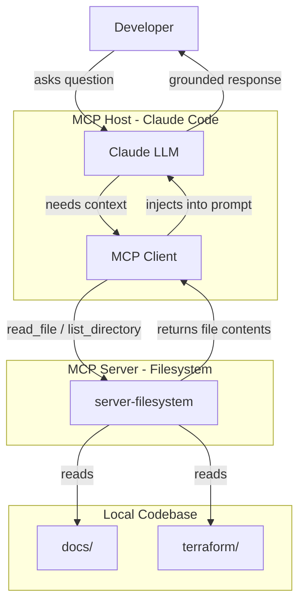
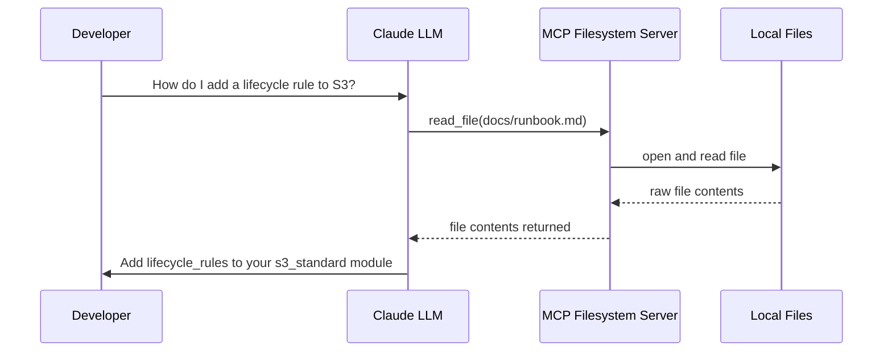

# MCP Demo — Platform Engineering

> A working demo of **Model Context Protocol (MCP)** powering an AI assistant across a real-world platform engineering codebase.

---

## What is Model Context Protocol?

**Model Context Protocol (MCP)** is an open standard that lets AI models connect to external tools and data sources through a structured, secure interface. Instead of copy-pasting context into a chat window, MCP servers expose resources (files, APIs, databases) that the model can read and act on directly.

Think of it like a USB standard for AI — any compliant host (Claude, an IDE, a CLI) can plug into any compliant server (filesystem, GitHub, Postgres, Slack) without bespoke integration code.

---

## How This Repo Uses MCP

This project wires **Claude Code** to a local **MCP Filesystem Server**. Claude can read the Terraform modules and docs directories at query time, so it has live, accurate context about the infrastructure — not a stale snapshot.

```
.claude/settings.local.json   ← MCP server config lives here
```

### Architecture



### What the MCP Filesystem Server exposes

| MCP Tool | What it does |
|---|---|
| `list_directory` | Lists files in a directory |
| `read_file` | Reads a file's contents |
| `search_files` | Searches for a pattern across files |
| `get_file_info` | Returns metadata (size, modified date) |

Claude calls these tools automatically when it needs to look something up — you never have to paste file contents manually.

---

## Project Structure

```
mcp_demo/
├── .claude/
│   └── settings.local.json      # MCP server config & permissions
├── docs/
│   ├── onboarding.md            # Developer onboarding guide
│   └── runbook.md               # Operational runbook
└── terraform/
    ├── modules/
    │   ├── vpc_standard/        # VPC + subnets + NAT
    │   ├── ecs_cluster/         # Fargate cluster + IAM
    │   └── s3_standard/         # S3 + encryption + lifecycle
    └── examples/
        └── dev_environment/     # Full working example
```

---

## MCP in Action — Example Interactions

Once Claude Code is running with the filesystem MCP server attached, you can ask questions like these and Claude will read the actual files to answer:

**"What Terraform modules does this platform provide?"**
> Claude calls `list_directory` on `terraform/modules/`, reads each module's `variables.tf`, and summarises them.

**"How do I enable SSM secrets access for my ECS task?"**
> Claude reads `docs/runbook.md` and returns the exact steps with the correct SSM path pattern.

**"What's the naming convention for S3 buckets?"**
> Claude reads `docs/onboarding.md` and returns `{environment}-{bucket_name}-{team}` with an example.

**"Review my `main.tf` and flag any prod-unsafe settings."**
> Claude reads your file directly and checks against the guidance in the docs.

---

## MCP Protocol Flow (simplified)



---

## Running This Demo

### Prerequisites

- [Claude Code](https://claude.ai/claude-code) installed (`npm install -g @anthropic-ai/claude-code`)
- Node.js 18+

### Start a session

```bash
# From the repo root — Claude Code picks up .claude/settings.local.json automatically
claude
```

The MCP filesystem server starts automatically. Try asking Claude anything about the infrastructure or docs — it will read the files in real time.

### MCP server config

```json
// .claude/settings.local.json
{
  "permissions": {
    "allow": [
      "Bash(npx --yes @modelcontextprotocol/server-filesystem:*)"
    ]
  }
}
```

---

## Why MCP vs. just pasting files?

| | Paste-and-pray | MCP |
|---|---|---|
| Context freshness | Stale — only what you copied | Live — reads files at query time |
| Token efficiency | All files upfront | Only fetches what's needed |
| Security | You decide what to paste | Server enforces read boundaries |
| Scalability | Falls apart past ~10 files | Works across large codebases |
| Composability | Manual every time | Any MCP host + any MCP server |

---

## Learn More

- [MCP Specification](https://modelcontextprotocol.io) — official spec and SDK docs
- [MCP Filesystem Server](https://github.com/modelcontextprotocol/servers/tree/main/src/filesystem) — the server used in this demo
- [Claude Code MCP docs](https://docs.anthropic.com/en/docs/claude-code/mcp) — how to configure MCP in Claude Code
